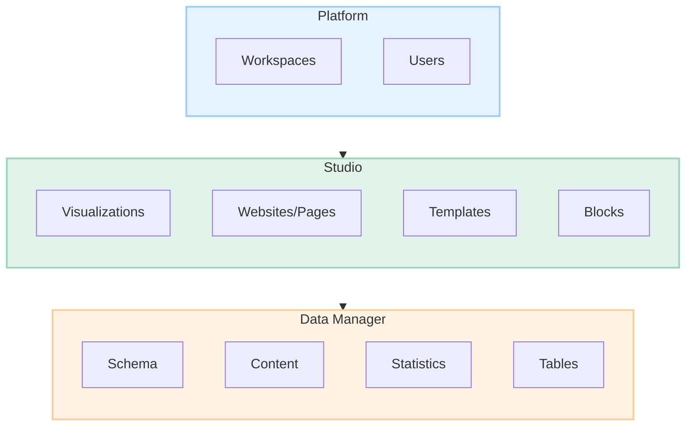

Whether you’re leveraging the Datastory platform for data storytelling, managing datasets, or using open data, this primer explains the core concepts and how they interconnect.

---



---

## Platform

The **Platform** is the foundation of Datastory, including concepts like **Workspaces** and **Users**:

- **Workspaces**: The Workspace is the home of your data, whether you are an organization or individual.
- **Users**: Individuals interacting with Datastory. Roles define permissions, from content creation to data management and sharing insights.

---

## Studio

The **Studio** is where data storytelling takes shape. It provides tools for:

### Visualizations

Data representations such as charts, graphs, and maps for clear and effective communication.

### Websites and Pages

Collections of **Pages** (**Websites**) or single canvases (**Pages**) designed to present and share your data in applications and interactive reports.

### Templates

#### Datastory Templates

Within Studio, you can find Datastory's official templates in different categories:

- Visualization templates: Common variations of popular charts
- Page templates: Starting points for landing pages, dashboards, interactive reports and other applications
- Website templates: Website starting points for different sectors
- Layout templates: Common website patterns

#### Save your own templates

You can also save your own creations as templates for your organization. We support these scenarios:

- Page templates
- Visualization templates
- Layout templates
- Components

### Blocks and block categories

When you build Pages in Studio, you are combining different blocks such as Heading, Image, Line chart and Table. Every page is a stack of blocks combined however you want.

The default block in Datastory is <code>Text</code>, but there are many other types of blocks.

Basic blocks include for example: <code>Heading</code>, <code>Quote</code>, <code>Divider</code>, <code>Image</code>.

Advanced, data-driven blocks include: <code>Author</code>, <code>Line chart</code>, <code>Data table</code>

---

## Data Manager

The **Data Manager** organizes, transforms, and analyzes data with the following components:

### Schema

Structures your data through:

- **Models**: Define relationships between data, such as linking sales figures to customer demographics.
- **Properties**: Attributes within a **Model**, such as **Name**, **Age**, or **Location** for a **Customer**.

### Content

The actual records or entries:

- **Items**: Individual data points within a **Model**, like a single customer or product.

### Statistics

Organize data for analysis with:

- **Data Cubes**: Multidimensional datasets to explore data by dimensions like time, geography, or category.
- **Measures**: Quantifiable metrics, e.g., **Total Revenue** or **Average Engagement Rate**.

### Tables

Tabular data views for managing, filtering, and exploring records in a familiar spreadsheet-like format.

---

## Open Data

Open Data facilitates collaboration and efficiency:

- **Reusable Content**: Pre-created elements such as visualizations, blocks, or pages shared across projects.
- **Sources**: Data integrations (APIs, public datasets, proprietary feeds) accessible within Datastory.

---

## Advanced Modeling Concepts

Datastory builds on **Knowledge Graph** concepts and **Linked Data Principles**. At its core, Datastory uses:

- **Triple Store Models**: Enabling complex, interconnected data relationships.
- **Data Cube Models**: Designed for long-term applications and AI-driven projects.

Additionally, less structured data like **CSV files** is supported, easily converted to **Tables** for simple visualizations or analyses.

```

```
